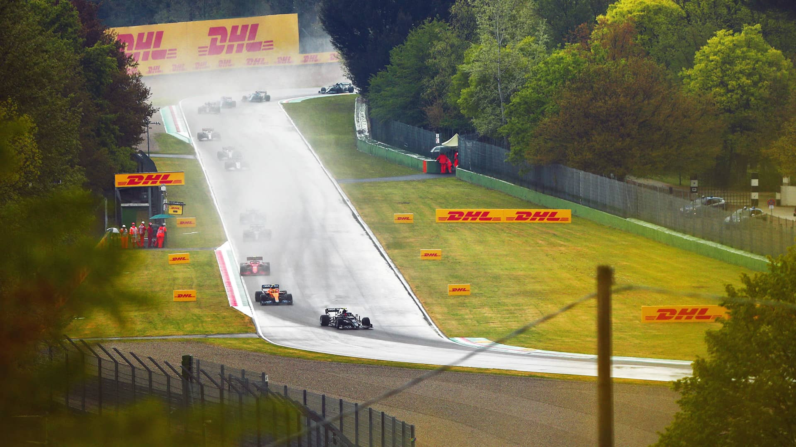

# 艾米利亚-罗马涅大奖赛

2022 年 4 月 22 日 — 24 日

## 简介

艾米利亚-罗马涅大奖赛﹙意大利语：Gran Premio dell'Emilia Romagna﹚是一级方程式赛车比赛其中一个分站。第一次比赛在 2020 年 10 月 31 日举行。赛道的名称是安佐与迪诺·法拉利赛道。比赛地点在艾米利亚-罗马涅大区伊莫拉。[^1]

| 首次办赛 |  赛道长度  | 单圈记录 | 比赛圈数 |   比赛距离   |
| :------: | :--------: | :------: | :------: | :----------: |
| 1980 年  | 4.909 公里 | 1:15.484 |  63 圈   | 309.049 公里 |

## 比赛结果

- 正赛
  | 冠军 | 亚军 | 季军 | 排位赛第一 | 杆位 | 正赛最快圈 |
  | :-------------: | :-------------: | :---------: | :-------------: | :-------------: | :-------------: |
  | 马克斯·维斯塔潘 | 塞尔吉·奥佩雷兹 | 兰多·诺里斯 | 马克斯·维斯塔潘 | 马克斯·维斯塔潘 | 马克斯·维斯塔潘 |
- 冲刺赛
  |冠军|亚军|季军|
  | :------------: | :-------------: | :---------: |
  |马克斯·维斯塔潘|夏尔·勒克莱尔|塞尔吉奥·佩雷兹|

[更多比赛细节](https://www.formula1.com/en/racing/2022/EmiliaRomagna.html)

[^1]: [维基百科词条：艾米利亚-罗马涅大奖赛](https://zh.wikipedia.org/wiki/%E8%89%BE%E7%B1%B3%E5%88%A9%E4%BA%9A-%E7%BD%97%E9%A9%AC%E6%B6%85%E5%A4%A7%E5%A5%96%E8%B5%9B)
