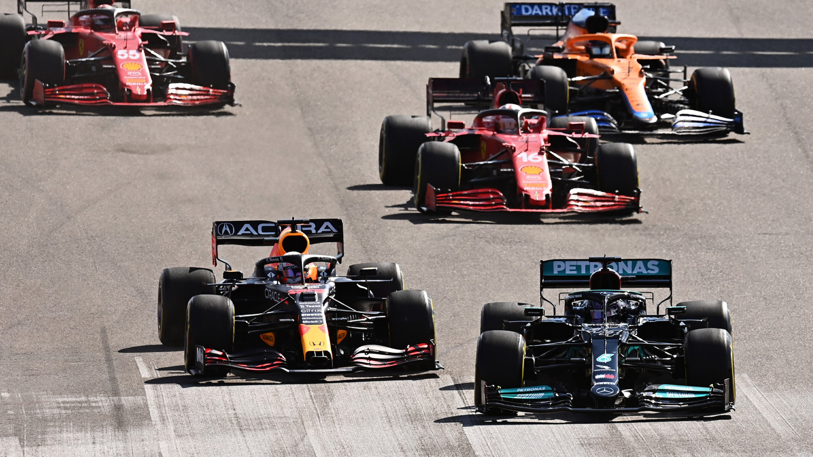
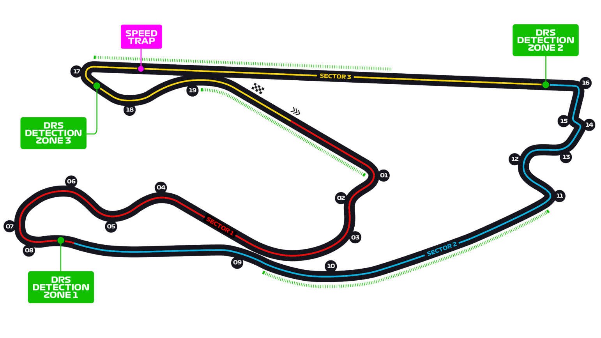

# 迈阿密大奖赛

2022 年 5 月 6 日 — 8 日

## 简介

迈阿密大奖赛﹙英语：Miami Grand Prix）是一级方程式赛车赛事，在 2022 赛季开始起举办十届赛事。比赛在位于美国迈阿密加登斯硬石体育场旁边的迈阿密国际赛道上举行。

2018 年，迈阿密大奖赛作为一级方程式世界锦标赛分站的提案提交至迈阿密市政府，并提议 2019 年起作为分站赛事的初步日期。由于迈阿密港的建设和开发计划出现问题，因此改为提交了 2021 年在硬石体育场举行赛事的提案。最终这个提案未能加入 2021 年世界一级方程式锦标赛的赛程，因为一级方程式赛车官方决定 2021 年赛季加入首届沙特阿拉伯大奖赛。而迈阿密大奖赛将会在 2022 年世界一级方程式锦标赛起加入赛程，比赛将在迈阿密国际赛道上举行，并且已经签约为期十年的合同。[^1]

| 首次办赛 |  赛道长度  | 单圈记录 | 比赛圈数 |   比赛距离   |
| :------: | :--------: | :------: | :------: | :----------: |
| 2022 年  | 5.412 公里 | 1:31.361 |  57 圈   | 308.326 公里 |

## 比赛结果

|      冠军       |     亚军      |     季军      |  排位赛第一   |     杆位      |   正赛最快圈    |
| :-------------: | :-----------: | :-----------: | :-----------: | :-----------: | :-------------: |
| 马克斯·维斯塔潘 | 夏尔·勒克莱尔 | 卡洛斯·塞恩斯 | 夏尔·勒克莱尔 | 夏尔·勒克莱尔 | 马克斯·维斯塔潘 |

[更多比赛细节](https://www.formula1.com/en/racing/2022/Miami.html)

[^1]: [维基百科词条：迈阿密大奖赛](https://zh.wikipedia.org/wiki/%E9%82%81%E9%98%BF%E5%AF%86%E5%A4%A7%E7%8D%8E%E8%B3%BD)
