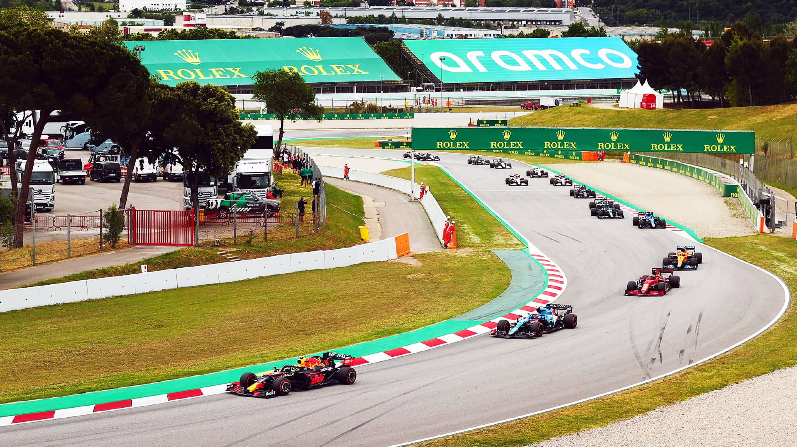
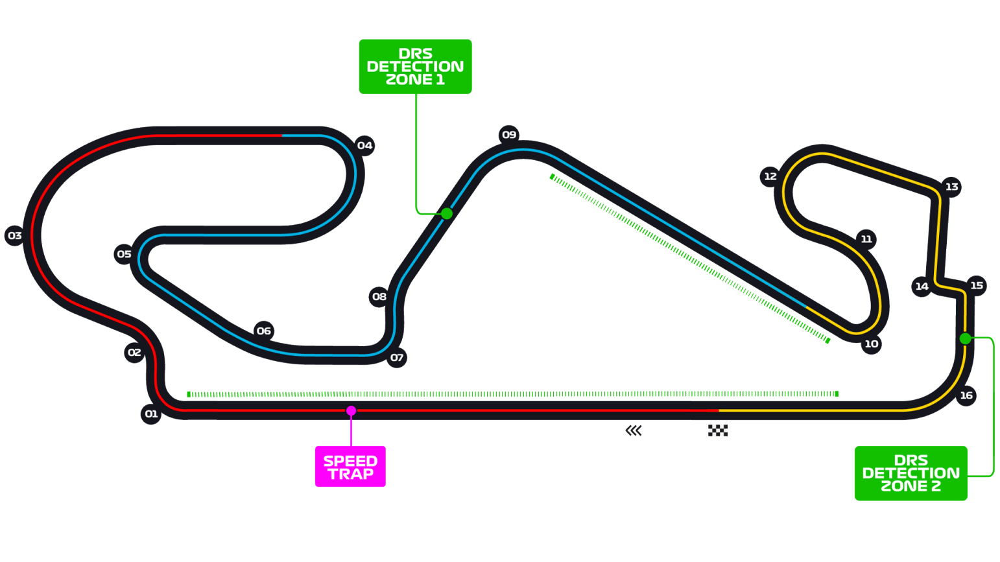

# 西班牙大奖赛

2022 年 5 月 20 日 — 22 日

## 简介

西班牙大奖赛（西班牙语：Gran Premio de España，加泰罗尼亚语：Gran Premi d'Espanya），为西班牙巴塞罗那一项一级方程式赛事，其赛场位于加泰罗尼亚赛道。[^1]

| 首次办赛 |  赛道长度  | 单圈记录 | 比赛圈数 |   比赛距离   |
| :------: | :--------: | :------: | :------: | :----------: |
| 1991 年  | 4.675 公里 | 1:18.149 |  66 圈   | 308.424 公里 |

## 比赛结果

|      冠军       |     亚军      |     季军      |  排位赛第一   |     杆位      |   正赛最快圈    |
| :-------------: | :-----------: | :-----------: | :-----------: | :-----------: | :-------------: |
| 马克斯·维斯塔潘 | 塞尔吉奥·佩雷兹 | 乔治·拉塞尔 | 夏尔·勒克莱尔 | 夏尔·勒克莱尔 | 塞尔吉奥·佩雷兹 |

[更多比赛细节](https://www.formula1.com/en/racing/2022/Spain.html)

[^1]: [维基百科词条：西班牙大奖赛](https://zh.wikipedia.org/wiki/%E8%A5%BF%E7%8F%AD%E7%89%99%E5%A4%A7%E5%A5%96%E8%B5%9B)
