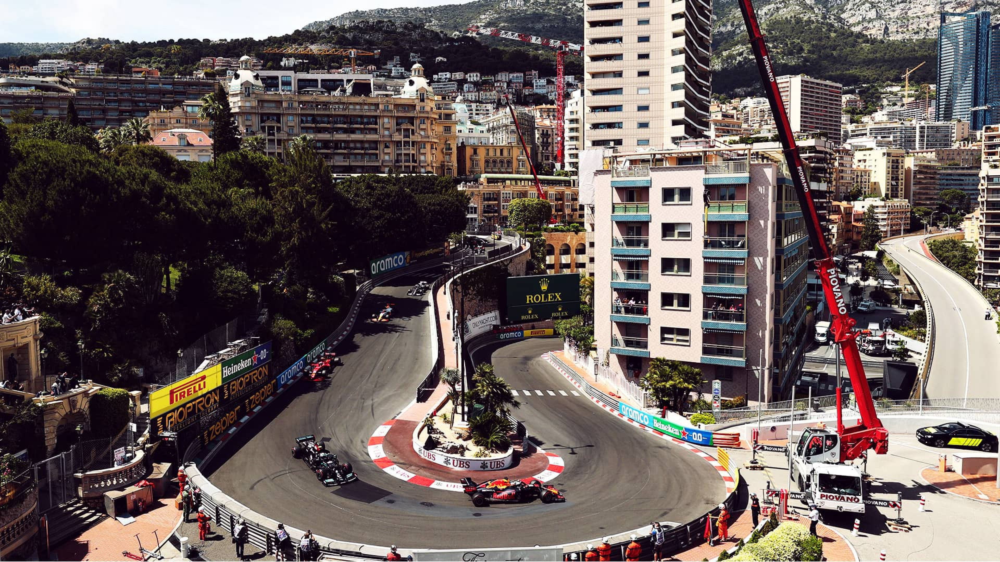
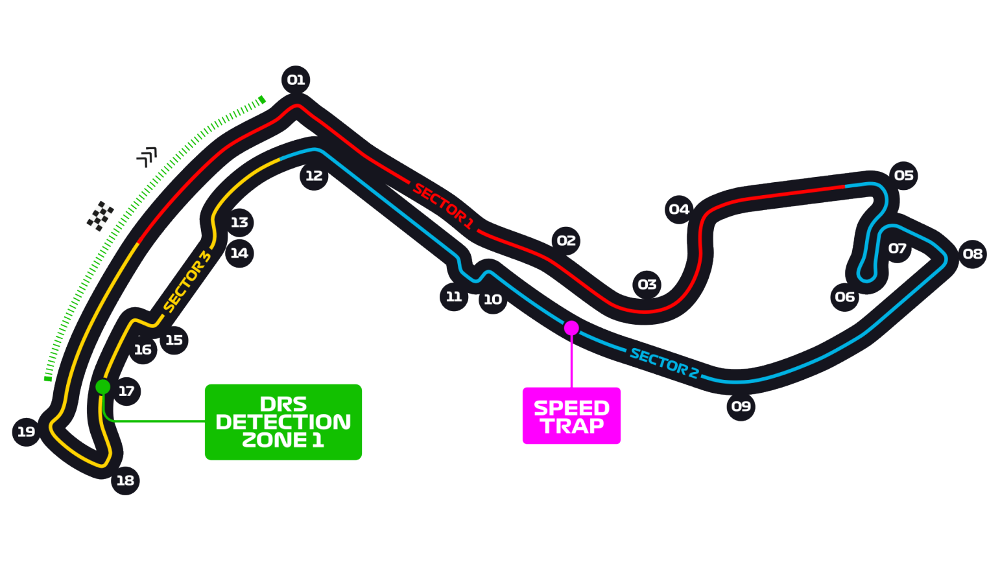

# 摩纳哥大奖赛

2022 年 5 月 27 日 — 29 日

## 简介

摩纳哥大奖赛（Grand Prix de Monaco）是一级方程式赛车每年在蒙特卡洛的摩纳哥赛道举行的比赛。从 1929 年开跑以来，与印第安纳波利斯 500 和勒芒 24 小时耐力赛被大众认为是最重要及最负盛名的汽车赛事（三冠王）。优美的风景和刺激的赛事让摩纳哥大奖赛有"一级方程式皇冠之上的明珠"（the jewel of the Formula One crown）称号[^1]

| 首次办赛 |  赛道长度  | 单圈记录 | 比赛圈数 |   比赛距离   |
| :------: | :--------: | :------: | :------: | :----------: |
| 1950 年  | 3.337 公里 | 1:12.909 |  78 圈   | 260.286 公里 |

## 比赛结果

|      冠军       |     亚军      |      季军       |  排位赛第一   |     杆位      | 正赛最快圈  |
| :-------------: | :-----------: | :-------------: | :-----------: | :-----------: | :---------: |
| 塞尔吉奥·佩雷兹 | 卡洛斯·塞恩斯 | 马克斯·维斯塔潘 | 夏尔·勒克莱尔 | 夏尔·勒克莱尔 | 兰多·诺里斯 |

[更多比赛细节](https://www.formula1.com/en/racing/2022/Monaco.html)

[^1]: [维基百科词条：摩纳哥大奖赛](https://zh.wikipedia.org/wiki/%E6%91%A9%E7%B4%8D%E5%93%A5%E5%A4%A7%E7%8D%8E%E8%B3%BD)
