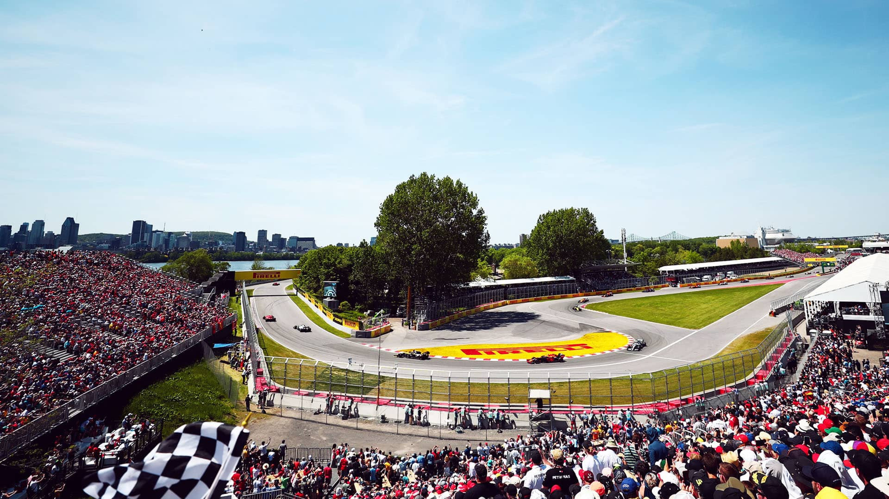
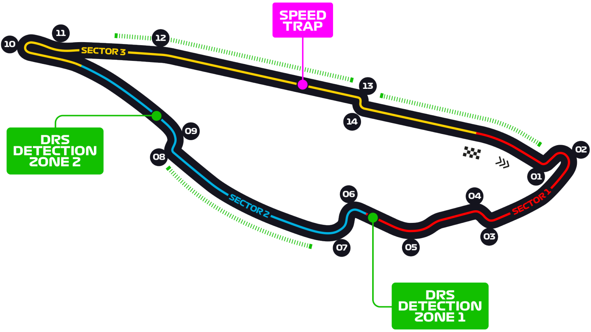

# 加拿大大奖赛

2022 年 6 月 17 日 — 19 日

## 简介

加拿大大奖赛（英语：Canadian Grand Prix，法语：Grand Prix du Canada）是从 1961 年举办的赛车比赛。从 1967 年开始加入一级方程式锦标赛。首次举办在加拿大安大略 Bowmanville 的 Mosport 公园，之后和 Circuit Mont-Tremblant 交错举办比赛。1971 年后因为安全因素 Circuit Mont-Tremblant 不再举办比赛。1987 年后大奖赛移到蒙特利尔 Île Notre-Dame 举行。[^1]

| 首次办赛 |  赛道长度  | 单圈记录 | 比赛圈数 |  比赛距离   |
| :------: | :--------: | :------: | :------: | :---------: |
| 1978 年  | 4.361 公里 | 1:13.078 |  70 圈   | 305.27 公里 |

## 比赛结果

|      冠军       |     亚军      |      季军       |   排位赛第一    |      杆位       |  正赛最快圈   |
| :-------------: | :-----------: | :-------------: | :-------------: | :-------------: | :-----------: |
| 马克斯·维斯塔潘 | 卡洛斯·塞恩斯 | 刘易斯·汉密尔顿 | 马克斯·维斯塔潘 | 马克斯·维斯塔潘 | 卡洛斯·塞恩斯 |

[更多比赛细节](https://www.formula1.com/en/racing/2022/Canada.html)

[^1]: [维基百科词条：加拿大大奖赛](https://zh.wikipedia.org/wiki/%E5%8A%A0%E6%8B%BF%E5%A4%A7%E5%A4%A7%E5%A5%96%E8%B5%9B)
