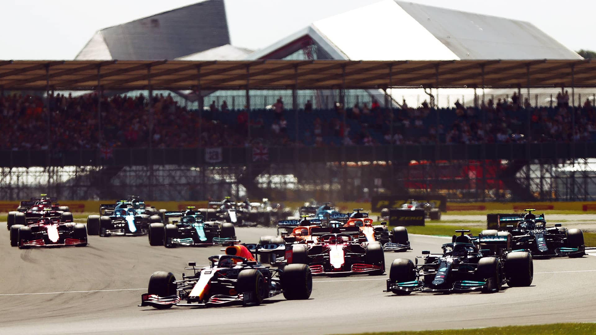
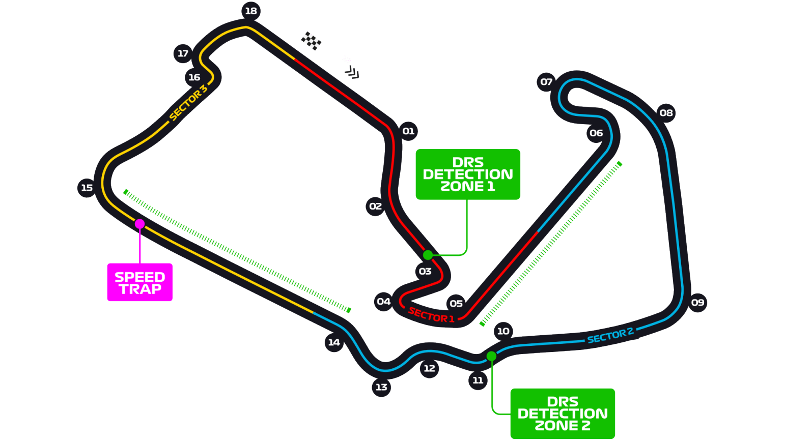

# 英国大奖赛

2022 年 7 月 1 日 — 3 日

## 简介

英国大奖赛是一级方程式锦标赛其中的赛程。在英国北安普敦郡银石附近的银石赛道举行。英国大奖赛和意大利大奖赛是世界一级方程式锦标赛中最久远的比赛。

一级方程式锦标赛第一次在银石赛道比赛是在 1950 年，从 1987 年开始一级方程式锦标赛就一直在银石赛道举办几赛；1964 年至 1986 年间与 Brands Hatch 交错举行比赛，1955 年至 1962 年间也在 Aintree Racecourse 举行比赛过。[^1]

| 首次办赛 |  赛道长度  | 单圈记录 | 比赛圈数 |   比赛距离   |
| :------: | :--------: | :------: | :------: | :----------: |
| 1950 年  | 5.891 公里 | 1:27.097 |  52 圈   | 306.198 公里 |

## 比赛结果

|     冠军      |      亚军       |      季军       |  排位赛第一   |     杆位      |   正赛最快圈    |
| :-----------: | :-------------: | :-------------: | :-----------: | :-----------: | :-------------: |
| 卡洛斯·塞恩斯 | 塞尔吉奥·佩雷兹 | 刘易斯·汉密尔顿 | 卡洛斯·塞恩斯 | 卡洛斯·塞恩斯 | 刘易斯·汉密尔顿 |

[更多比赛细节](https://www.formula1.com/en/racing/2022/Great_Britain.html)

[^1]: [维基百科词条：英国大奖赛](https://zh.wikipedia.org/wiki/%E8%8B%B1%E5%9B%BD%E5%A4%A7%E5%A5%96%E8%B5%9B)
