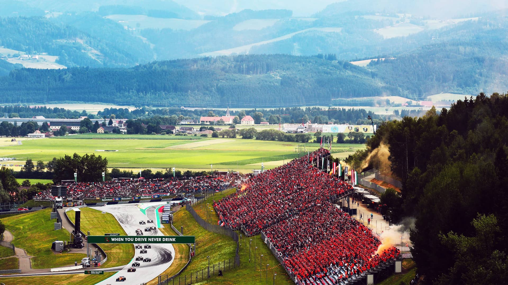
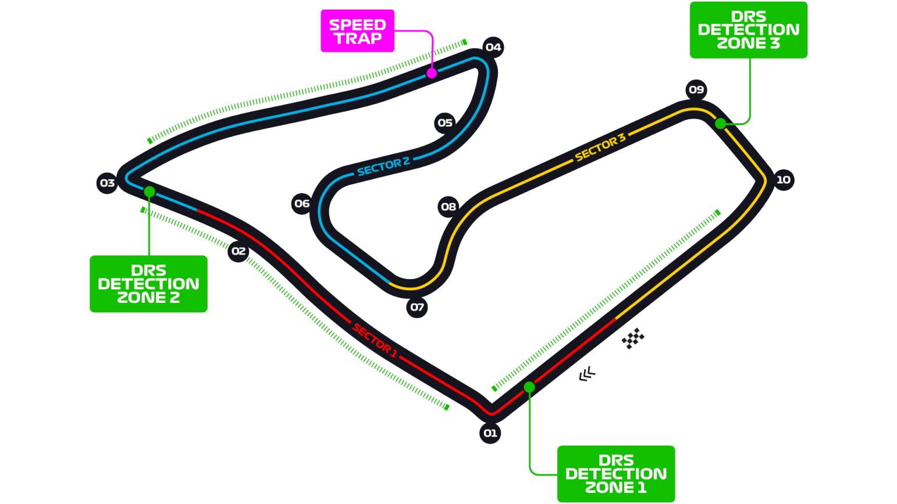

# 奥地利大奖赛

2022 年 7 月 8 日 — 10 日

## 简介

奥地利大奖赛（德语：Großer Preis von Österreich，英语：Austrian Grand Prix）是国际汽车联合会分别在 1964 年，1970 年至 1987 年，1997 年至 2003 年期间举办的一系列 F1 赛事。时隔 11 年，奥地利大奖赛于 2014 年重回世界一级方程式锦标赛赛历，比赛将在奥地利施泰尔马克邦施皮尔贝格的红牛赛道进行。[^1]

| 首次办赛 |  赛道长度  | 单圈记录 | 比赛圈数 |   比赛距离   |
| :------: | :--------: | :------: | :------: | :----------: |
| 1970 年  | 4.318 公里 | 1:05.619 |  71 圈   | 306.452 公里 |

## 比赛结果

- 正赛
  | 冠军 | 亚军 | 季军 | 排位赛第一 | 杆位 | 正赛最快圈 |
  | :----: | :----: | :----: | :--------: | :----: | :--------: |
  | 夏尔·勒克莱尔 | 马克斯·维斯塔潘 | 刘易斯·汉密尔顿 | 马克斯·维斯塔潘 | 马克斯·维斯塔潘 | 马克斯·维斯塔潘 |
- 冲刺赛
  |冠军|亚军|季军|
  | :------------: | :-------------: | :---------: |
  |马克斯·维斯塔潘|夏尔·勒克莱尔|卡洛斯·塞恩斯|

[更多比赛细节](https://www.formula1.com/en/racing/2022/Austria.html)

[^1]: [维基百科词条：奥地利大奖赛](https://zh.wikipedia.org/wiki/%E5%A5%A5%E5%9C%B0%E5%88%A9%E5%A4%A7%E5%A5%96%E8%B5%9B)
