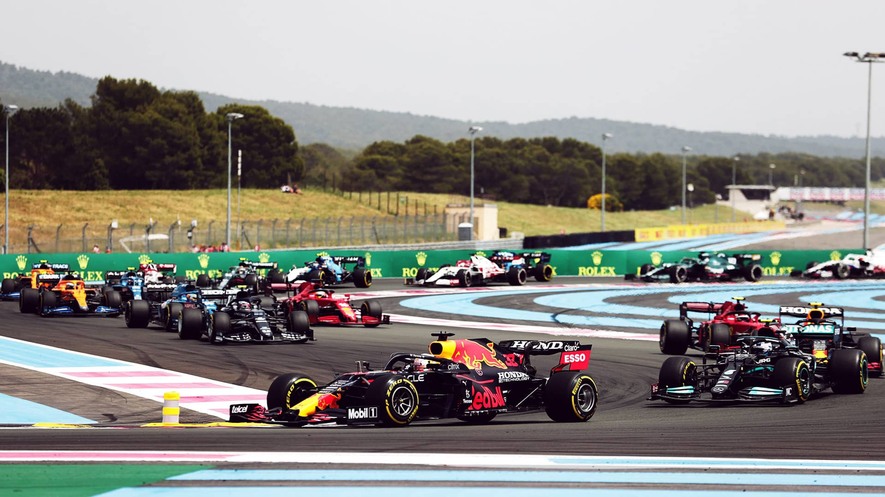
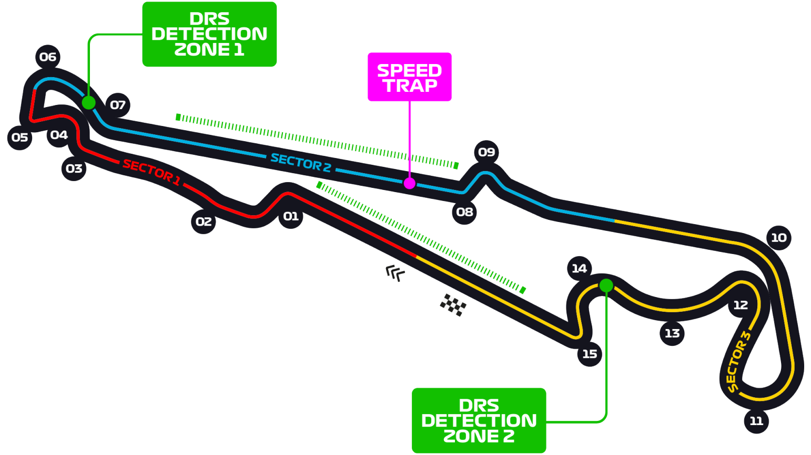

# 法国大奖赛

2022 年 7 月 22 日 — 24 日

## 简介

法国大奖赛（Grand Prix de France）是一级方程式锦标赛中的其中一个赛程。格兰披治大赛（Grand Prix motor racing）起源于法国和法国大奖赛，是开放的国际比赛，也是最古老的大奖赛，第一次举行在 1906 年 6 月 26 日在 Sarthe 由 Automobile Club de France 所举办，总共有 32 辆车上场赛。[^1]

| 首次办赛 |  赛道长度  | 单圈记录 | 比赛圈数 |  比赛距离   |
| :------: | :--------: | :------: | :------: | :---------: |
| 1971 年  | 5.842 公里 | 1:32.740 |  53 圈   | 309.69 公里 |

## 比赛结果

|      冠军       |      亚军       |    季军     |  排位赛第一   |     杆位      |  正赛最快圈   |
| :-------------: | :-------------: | :---------: | :-----------: | :-----------: | :-----------: |
| 马克斯·维斯塔潘 | 刘易斯·汉密尔顿 | 乔治·拉塞尔 | 夏尔·勒克莱尔 | 夏尔·勒克莱尔 | 卡洛斯·塞恩斯 |

[更多比赛细节](https://www.formula1.com/en/racing/2022/France.html)

[^1]: [维基百科词条：法国大奖赛](https://zh.wikipedia.org/wiki/%E6%B3%95%E5%9C%8B%E5%A4%A7%E7%8D%8E%E8%B3%BD)
