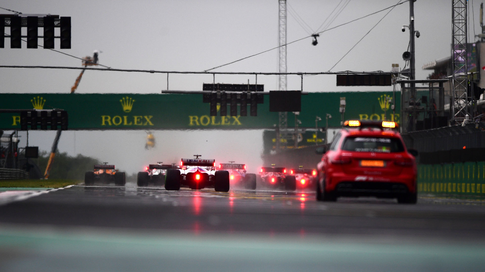
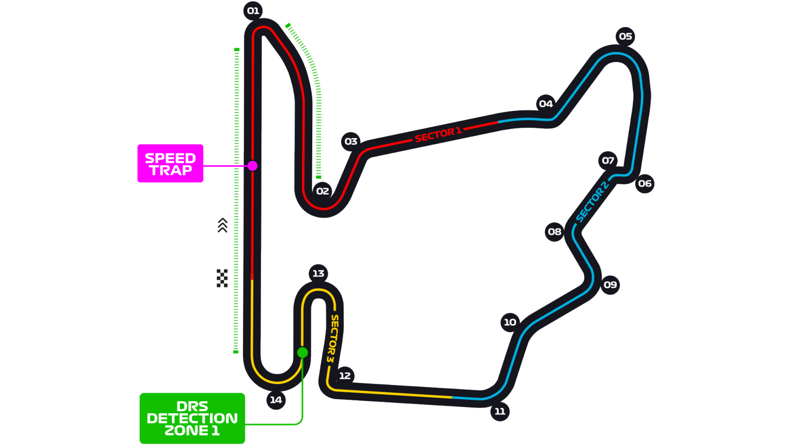

# 匈牙利大奖赛

2022 年 7 月 29 日 — 31 日

## 简介

匈牙利大奖赛（匈牙利语：Magyar Nagydíj）是一级方程式锦标赛的一项分站赛事。其前身是 1936 年在匈牙利布达佩斯的一个公园内举行的独立赛事，当时有奔驰、法拉利、Auto Union 三支车队参加了比赛。但由于第二次世界大战的爆发以及之后冷战时期的政治原因，匈牙利大奖赛在第一届之后就宣布停办，直到 50 年后才得以恢复。[^1]

| 首次办赛 |  赛道长度  | 单圈记录 | 比赛圈数 |  比赛距离   |
| :------: | :--------: | :------: | :------: | :---------: |
| 1986 年  | 4.381 公里 | 1:16.627 |  70 圈   | 306.63 公里 |

## 比赛结果

|      冠军       |      亚军       |    季军     | 排位赛第一  |    杆位     |   正赛最快圈    |
| :-------------: | :-------------: | :---------: | :---------: | :---------: | :-------------: |
| 马克斯·维斯塔潘 | 刘易斯·汉密尔顿 | 乔治·拉塞尔 | 乔治·拉塞尔 | 乔治·拉塞尔 | 刘易斯·汉密尔顿 |

[更多比赛细节](https://www.formula1.com/en/racing/2022/Hungary.html)

[^1]: [维基百科词条：匈牙利大奖赛](https://zh.wikipedia.org/wiki/%E5%8C%88%E7%89%99%E5%88%A9%E5%A4%A7%E5%A5%96%E8%B5%9B)
