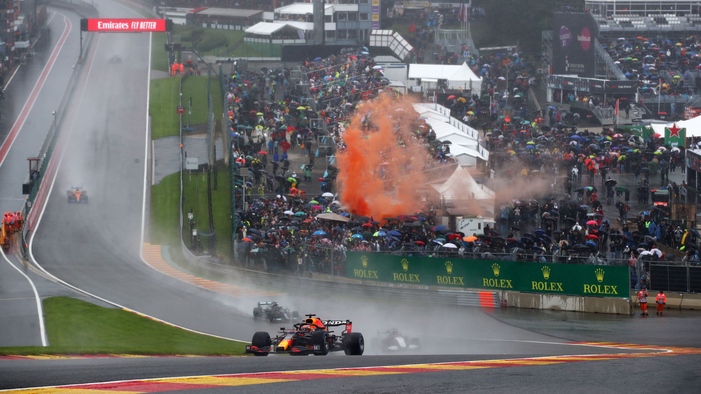
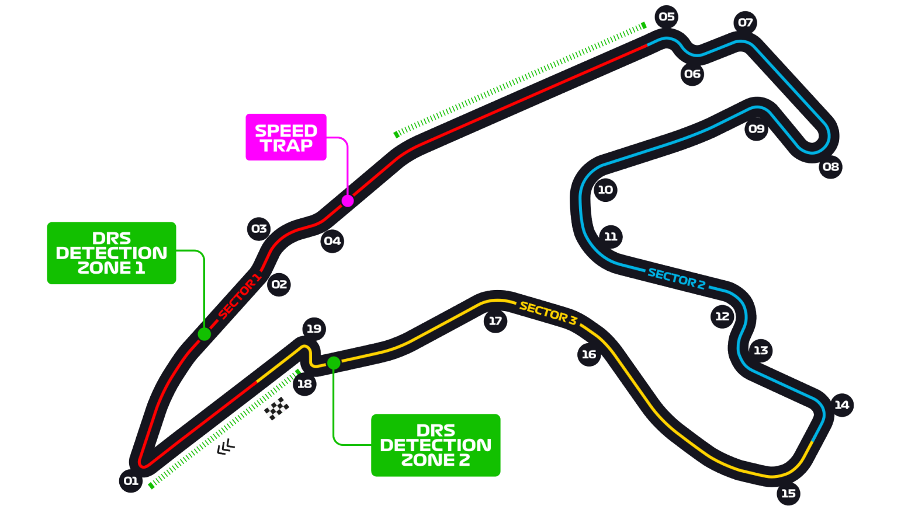

# 比利时大奖赛

2022 年 8 月 26 日 — 28 日

## 简介

比利时大奖赛是是一级方程式锦标赛的其中一站，于比利时斯帕的斯帕-弗朗科尔尚赛道举行。由于这条赛道富于变化，加上高低起伏和阴晴不定的山区赛道的魅力，是 F1 赛季中广受车迷欢迎的赛道。

斯帕赛道事故多发，1998 年的发车阶段发生了著名的 13 辆车同时被毁的连环撞车，不得不在第一圈就挥舞红旗暂停比赛。比利时赛道是一年中最长的赛道，虽然是一条高速赛道（一年中仅次于意大利的蒙扎赛道），单圈时间仍长达 1 分 30 秒以上。另外长距离的赛道造成不同的赛段天气可能完全不同，给车手和车组人员都造成了极大的挑战。[^1]

| 首次办赛 |  赛道长度  | 单圈记录 | 比赛圈数 |   比赛距离   |
| :------: | :--------: | :------: | :------: | :----------: |
| 1950 年  | 7.004 公里 | 1:46.286 |  44 圈   | 308.052 公里 |

## 比赛结果

|      冠军       |      亚军       |     季军      |   排位赛第一    |     杆位      |   正赛最快圈    |
| :-------------: | :-------------: | :-----------: | :-------------: | :-----------: | :-------------: |
| 马克斯·维斯塔潘 | 塞尔吉奥·佩雷兹 | 卡洛斯·塞恩斯 | 马克斯·维斯塔潘 | 卡洛斯·塞恩斯 | 马克斯·维斯塔潘 |

[更多比赛细节](https://www.formula1.com/en/racing/2022/Belgium.html)

[^1]: [维基百科词条：比利时大奖赛](https://zh.wikipedia.org/wiki/%E6%AF%94%E5%88%A9%E6%99%82%E5%A4%A7%E7%8D%8E%E8%B3%BD)
