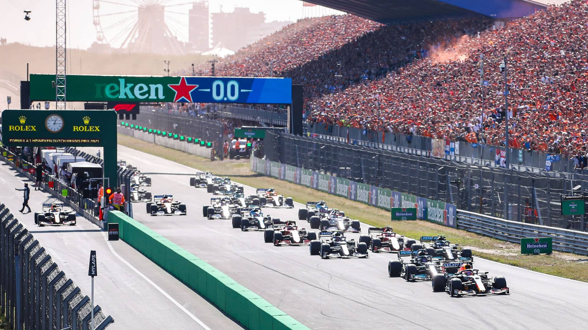
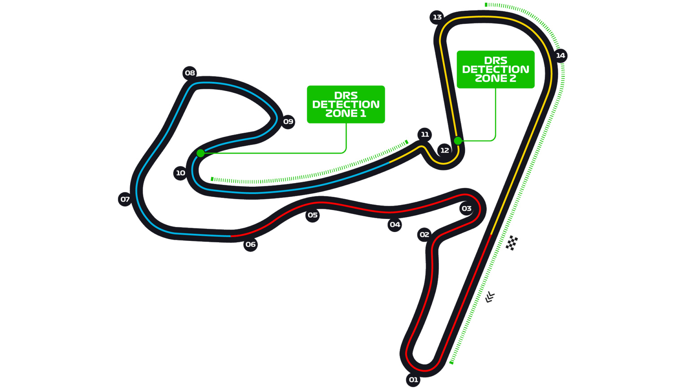

# 荷兰大奖赛

2022 年 9 月 2 日 — 4 日

## 简介

荷兰大奖赛（荷兰语：Grote Prijs van Nederland）是一级方程式锦标赛其中的赛程。在荷兰赞德福特北部的赞德福特赛道举行。赛事曾在 1948 年到 1985 年举办，并且计划于 2020 年回归赛历，但因为 2019 冠状病毒病疫情取消当年比赛并延期到 2021 年赛季回归。从 1952 年起，荷兰大奖赛成为世界锦标赛的一站，并且在 1962 年和 1976 年承办欧洲大奖赛，在当时每年赛季会有一场在欧洲举办的比赛被授予“欧洲大奖赛”的荣誉称号。[^1]

| 首次办赛 |  赛道长度  | 单圈记录 | 比赛圈数 |   比赛距离   |
| :------: | :--------: | :------: | :------: | :----------: |
| 1952 年  | 4.259 公里 |  1:11.097 |  72 圈   | 306.587 公里 |

## 比赛结果

|      冠军       |    亚军     |     季军      |   排位赛第一    |      杆位       |   正赛最快圈    |
| :-------------: | :---------: | :-----------: | :-------------: | :-------------: | :-------------: |
| 马克斯·维斯塔潘 | 乔治·拉塞尔 | 夏尔·勒克莱尔 | 马克斯·维斯塔潘 | 马克斯·维斯塔潘 | 马克斯·维斯塔潘 |

[更多比赛细节](https://www.formula1.com/en/racing/2022/Netherlands.html)

[^1]: [维基百科词条：荷兰大奖赛](https://zh.wikipedia.org/wiki/%E8%8D%B7%E5%85%B0%E5%A4%A7%E5%A5%96%E8%B5%9B)
