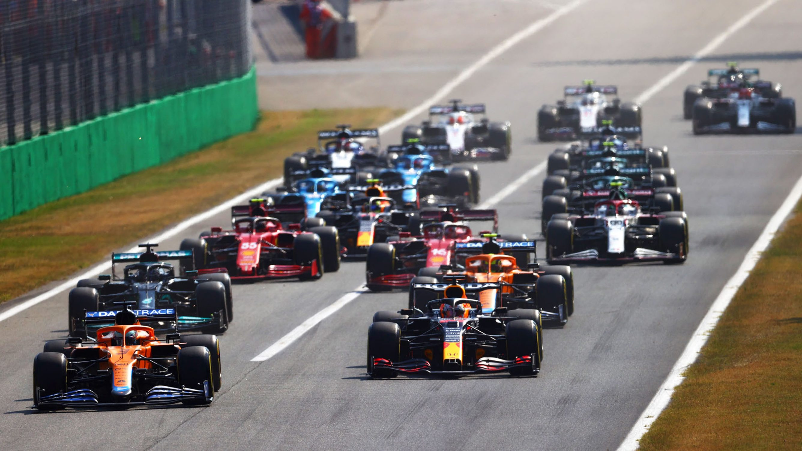
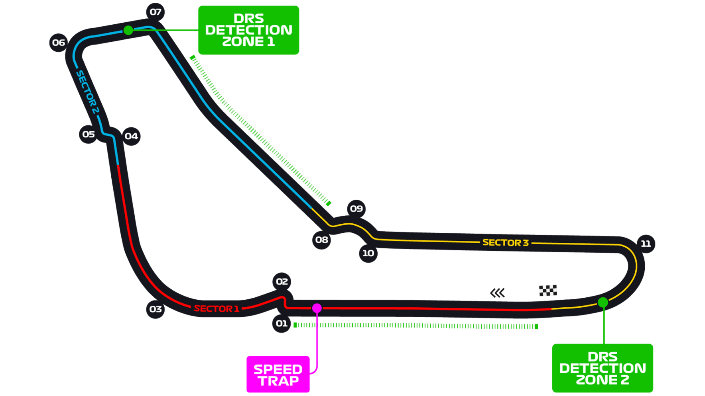

# 意大利大奖赛

2022 年 9 月 9 日 — 11 日

## 简介

意大利大奖赛是赛车比赛中赛道最长的赛事之一。1921 年 9 月 4 日，首届意大利大奖赛在布雷西亚举行。然而，比赛地点很靠近蒙扎赛道，也就是 1922 年赛建立，日后作为大奖赛的常用赛道。

意大利大奖赛是世界一级方程式锦标赛 1950 年的创始赛道之一，此后每年都有举行。唯一每年均举行的另一项赛事是英国大奖赛。

在取胜 2006 年意大利大奖赛后, 迈克尔·舒马赫宣布在 2006 年赛季结束后退役。莱科宁于 2007 赛季接替他在法拉利的位置。 在 2008 年的意大利大奖赛, 年仅 21 岁 74 天赛巴斯蒂安·维特尔成为历史上最年轻的大奖赛冠军。比赛中维泰尔大部分时间处于领先，最后以超过第二名科瓦莱宁 12.5 秒的优势冲过终点。早先, 他已经成为最年轻的杆位获得者。2010 年 3 月 18 日，F1 总监伯尼·埃克莱斯顿和赛事经理已经续约至 2016 年。[^1]

| 首次办赛 |  赛道长度  | 单圈记录 | 比赛圈数 |  比赛距离   |
| :------: | :--------: | :------: | :------: | :---------: |
| 1950 年  | 5.793 公里 | 1:21.046 |  53 圈   | 306.72 公里 |

## 比赛结果

|      冠军       |     亚军      |    季军     |  排位赛第一   |     杆位      |   正赛最快圈    |
| :-------------: | :-----------: | :---------: | :-----------: | :-----------: | :-------------: |
| 马克斯·维斯塔潘 | 夏尔·勒克莱尔 | 乔治·拉塞尔 | 夏尔·勒克莱尔 | 夏尔·勒克莱尔 | 塞尔吉奥·佩雷兹 |

[更多比赛细节](https://www.formula1.com/en/racing/2022/Italy.html)

[^1]: [维基百科词条: 意大利大奖赛](https://zh.wikipedia.org/wiki/%E6%84%8F%E5%A4%A7%E5%88%A9%E5%A4%A7%E5%A5%96%E8%B5%9B)
