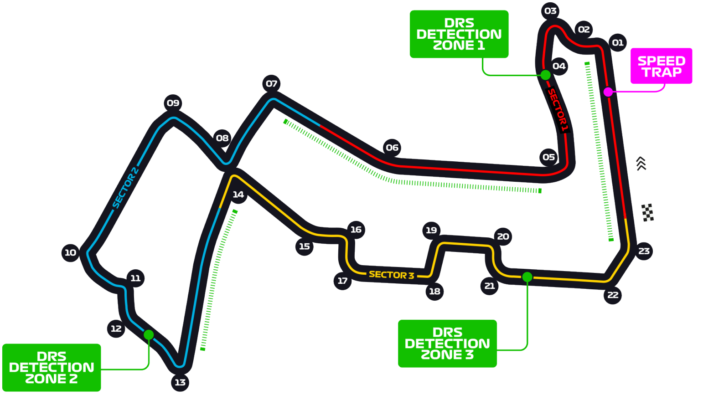

# 新加坡大奖赛

2022 年 9 月 30 日—10 月 2 日

## 简介

新加坡大奖赛是一级方程式赛车比赛中的一个分站，是全球第一个在夜间举行的 F1 大奖赛，于 2008 年 9 月 28 日首次举行。赛道的名称是滨海湾市街赛道(Marina Bay Street Circuit)，紧邻滨海湾。另外，在 1961 至 1973 年，曾经有赛车比赛以“新加坡大奖赛”的名义举行，但与一级方程式赛车并没有关系，使用的是汤申律赛道。另外，新加坡大奖赛至今仍保持所有比赛都出安全车的纪录。[^1]

| 首次办赛 |  赛道长度  | 单圈记录 | 比赛圈数 |   比赛距离   |
| :------: | :--------: | :------: | :------: | :----------: |
| 2008 年  | 5.063 公里 | 1:41.905 |  61 圈   | 308.706 公里 |

## 比赛结果

|      冠军       |     亚军      |     季军      |  排位赛第一   |     杆位      | 正赛最快圈  |
| :-------------: | :-----------: | :-----------: | :-----------: | :-----------: | :---------: |
| 塞尔吉奥·佩雷兹 | 夏尔·勒克莱尔 | 卡洛斯·赛恩斯 | 夏尔·勒克莱尔 | 夏尔·勒克莱尔 | 乔治·拉塞尔 |

[更多比赛细节](https://www.formula1.com/en/racing/2022/Singapore.html)

[^1]: [维基百科词条: 新加坡大奖赛](https://zh.wikipedia.org/wiki/%E6%96%B0%E5%8A%A0%E5%9D%A1%E5%A4%A7%E5%A5%96%E8%B5%9B)
