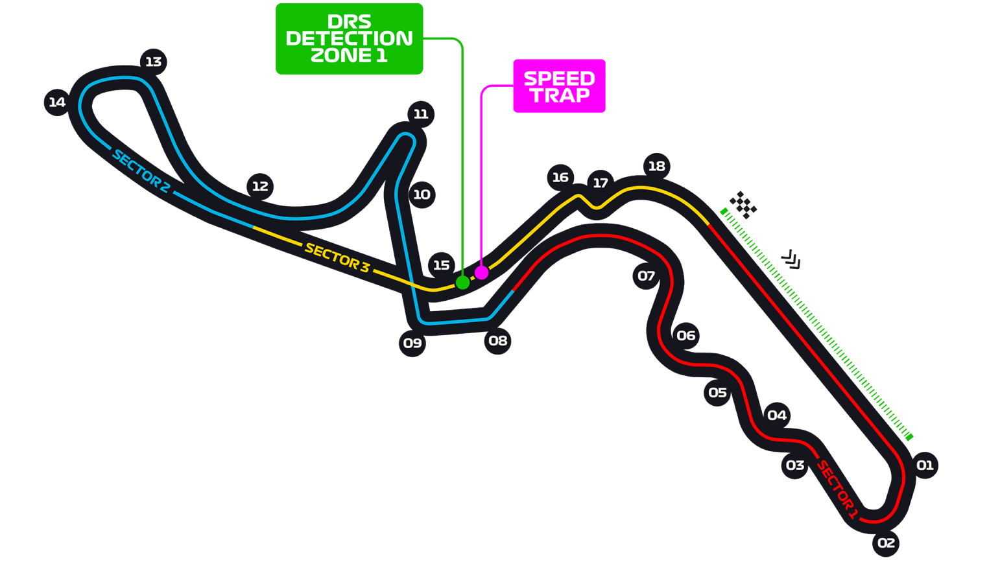

# 日本大奖赛

2022 年 10 月 7 日—9 日

## 简介

日本大奖赛是一级方程式赛车的其中一站，通常安排于赛季尾段举行。2004 年，巴西大奖赛取代日本，成为一级方程式赛季最后一站。

日本大奖赛早期在富士赛车场举行，1987 年一级方程式大赛车重返日本，首次安排在铃鹿赛道举行，但是在 2007 年，将会再次由富士赛车场再次代替铃鹿赛道。但是在 2009 年再次在铃鹿赛车场举行。[^1]

| 首次办赛 |  赛道长度  | 单圈记录 | 比赛圈数 |   比赛距离   |
| :------: | :--------: | :------: | :------: | :----------: |
| 1987 年  | 5.807 公里 | 1:30.983 |  53 圈   | 307.741 公里 |

## 比赛结果

|  冠军  |  亚军  |  季军  | 排位赛第一 |  杆位  | 正赛最快圈 |
| :----: | :----: | :----: | :--------: | :----: | :--------: | ------ |
| 未开赛 | 未开赛 | 未开赛 |   未开赛   | 未开赛 |   未开赛   | 未开赛 |

[更多比赛细节](https://www.formula1.com/en/racing/2022/Japan.html)

## 比赛录像

- **天翼超高清**
  |信号源|一练|二练|三练|排位赛|正赛|
  |:-:|:-:|:-:|:-:|:-:|:-:|
  |主信号||||||
  |无解说||||||
  |维修区视角||||||
  |车载镜头||||||

  在线观看:

  微力同步:

- **F1TV**

  | 信号源 | 一练 | 二练 | 三练 | 排位赛 | 正赛 |
  | :----: | :--: | :--: | :--: | :----: | :--: |
  | 多音轨 |      |      |      |        |      |

  微力同步:

- **Sky Sport F1**

  | 信号源 | 一练 | 二练 | 三练 | 排位赛 | 正赛 |
  | :----: | :--: | :--: | :--: | :----: | :--: |
  |  :gb:  |      |      |      |        |      |

  微力同步:

[^1]: [维基百科词条：日本大奖赛](https://zh.wikipedia.org/wiki/%E6%97%A5%E6%9C%AC%E5%A4%A7%E7%8D%8E%E8%B3%BD)
