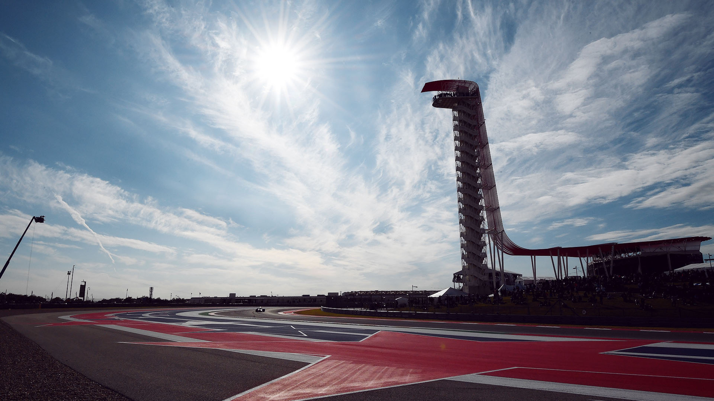

# 美国大奖赛

2022 年 10 月 21 日 — 23 日

## 简介

美国大奖赛（United States Grand Prix）是自 1908 年开始举办的一项汽车赛事。其前期为一项独立的大奖赛赛事，而在 1950 年成为世界一级方程式锦标赛的一个分站。F1 美国大奖赛一共在 9 个不同的赛场举办过 41 届，最近一届于 2007 年在印第安纳波利斯举行。时隔五年之后，2012 年美国大奖赛于 11 月 18 日在得克萨斯州奥斯丁的美洲赛道恢复举办。[^1]

| 首次办赛 |  赛道长度  | 单圈记录 | 比赛圈数 |   比赛距离   |
| :------: | :--------: | :------: | :------: | :----------: |
| 2012 年  | 5.513 公里 | 1:36.169 |  56 圈   | 308.405 公里 |

## 比赛结果

|  冠军  |  亚军  |  季军  |  排位赛第一   |  杆位  | 正赛最快圈 |
| :----: | :----: | :----: | :-----------: | :----: | :--------: |
| 待开赛 | 待开赛 | 待开赛 | 卡洛斯·塞恩斯 | 待开赛 |   待开赛   |

[更多比赛细节](https://www.formula1.com/en/racing/2022/United_States.html)

[^1]: [维基百科词条：美国大奖赛](https://zh.wikipedia.org/wiki/%E7%BE%8E%E5%9B%BD%E5%A4%A7%E5%A5%96%E8%B5%9B)
