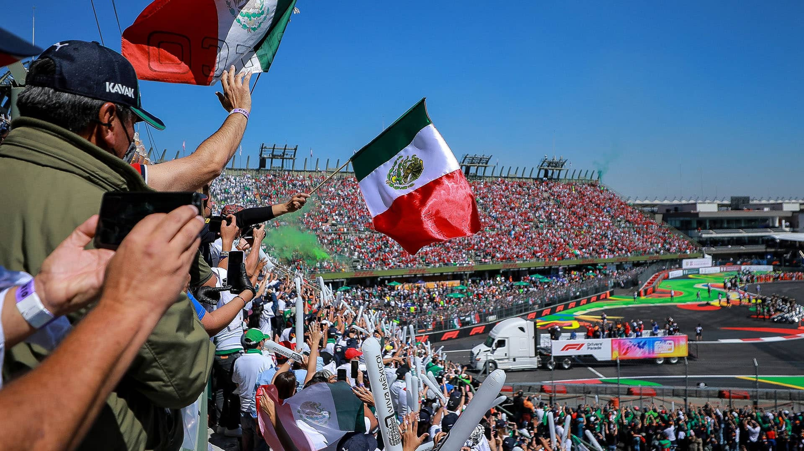
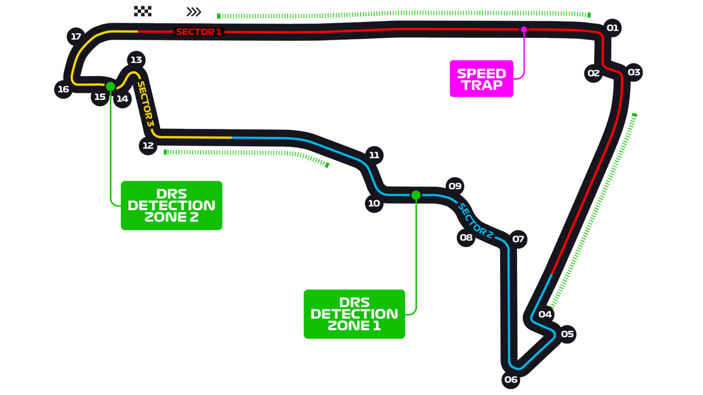

# 墨西哥城大奖赛

2022 年 10 月 28 日 — 30 日

## 简介

墨西哥城大奖赛（西班牙语：Gran Premio de la Ciudad de México），前称墨西哥大奖赛（西班牙语：Gran Premio de México）是举办于墨西哥城罗德里格斯兄弟赛道的世界一级方程式锦标赛分站赛事。墨西哥最早曾在 1962 年举办非锦标赛赛事，接着在 1963 至 1970 年与 1986 至 1992 年间举办锦标赛赛事。墨西哥大奖赛在 2015 年重返，在 2020 年暂停一年后，于 2021 赛季更名为墨西哥城大奖赛。[^1]

| 首次办赛 |  赛道长度  | 单圈记录 | 比赛圈数 |   比赛距离   |
| :------: | :--------: | :------: | :------: | :----------: |
| 1963 年  | 4.304 公里 | 1:17.774 |  71 圈   | 305.354 公里 |

## 比赛结果

|  冠军  |  亚军  |  季军  | 排位赛第一 |  杆位  | 正赛最快圈 |
| :----: | :----: | :----: | :--------: | :----: | :--------: |
| 未开赛 | 未开赛 | 未开赛 |   马克斯·维斯塔潘   | 未开赛 |   未开赛   |

[更多比赛细节](https://www.formula1.com/en/racing/2022/Mexico.html)

[^1]: [维基百科词条：墨西哥城大奖赛](https://zh.wikipedia.org/wiki/%E5%A2%A8%E8%A5%BF%E5%93%A5%E5%9F%8E%E5%A4%A7%E5%A5%96%E8%B5%9B)
