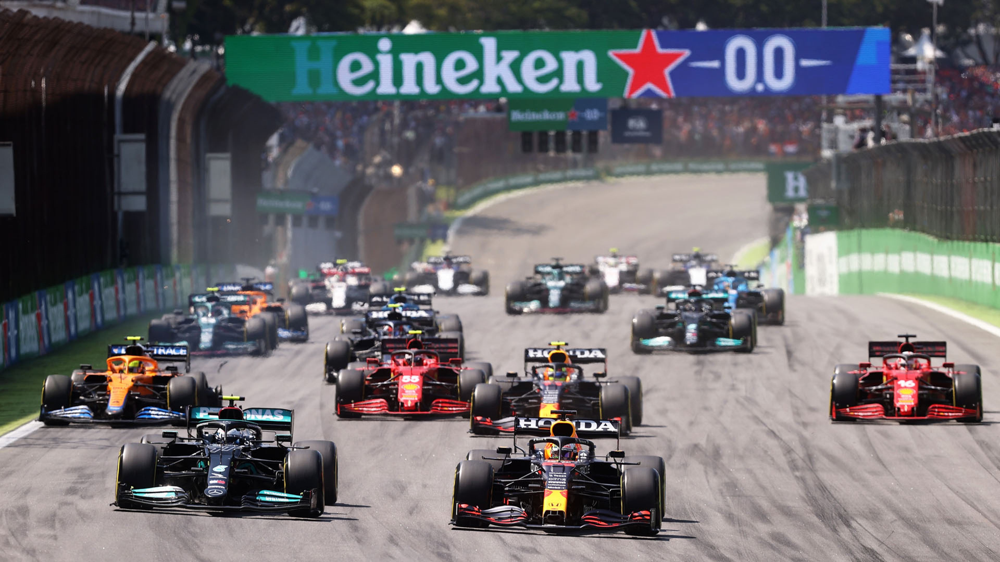
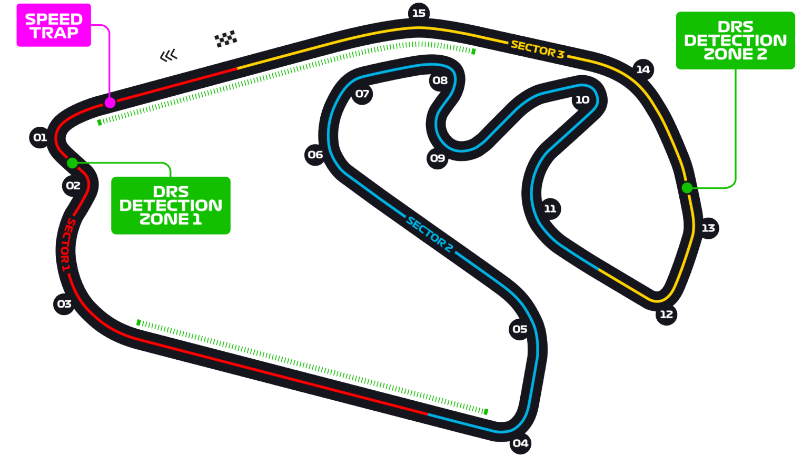

# 巴西大奖赛

2022 年 11 月 11 日 — 13 日

## 简介

一级方程式赛车巴西大奖赛从 1973 年起开始举行一直至今，1972 年也曾经举行过一次比赛，但该场比赛不计入当年的积分榜。2021 年起，赛事更名为“圣保罗大奖赛”。[^1]

| 首次办赛 |  赛道长度  | 单圈记录 | 比赛圈数 |   比赛距离   |
| :------: | :--------: | :------: | :------: | :----------: |
| 1973 年  | 4.309 公里 | 1:10.540 |  71 圈   | 305.879 公里 |

## 比赛结果

- 正赛
  | 冠军 | 亚军 | 季军 | 排位赛第一 | 杆位 | 正赛最快圈 |
  | :----: | :----: | :----: | :--------: | :----: | :--------: |
  | 乔治·拉塞尔 | 刘易斯·汉密尔顿 | 卡洛斯·塞恩斯 | 凯文·马格努森 | 乔治·拉塞尔 | 乔治·拉塞尔 |

- 冲刺赛
  |冠军|亚军|季军|
  | :------------: | :-------------: | :---------: |
  |乔治·拉塞尔|卡洛斯·塞恩斯|刘易斯·汉密尔顿|

[更多比赛细节](https://www.formula1.com/en/racing/2022/Brazil.html)

[^1]: [维基百科词条：巴西大奖赛](https://zh.wikipedia.org/wiki/%E5%B7%B4%E8%A5%BF%E5%A4%A7%E5%A5%96%E8%B5%9B)
