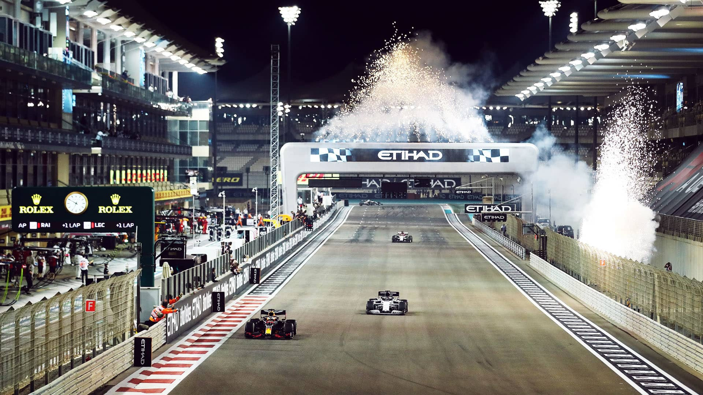
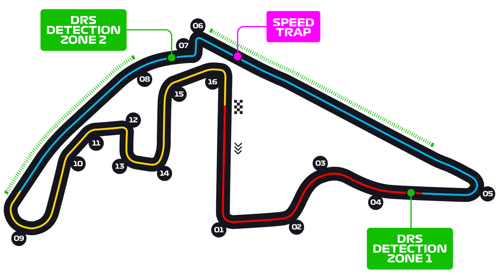

# 阿布扎比大奖赛

2022 年 11 月 18 日 — 20 日

## 简介

一级方程式赛车于 2007 年以 F1 赛车节的形式出现在阿布扎比，2007 年 2 月 3 日举办。2 月 3 日，F1 管理委员会宣布阿布扎比获得 2009 年一级方程式大奖赛的承办权。同年 12 月，总部设于阿布扎比的伊蒂哈德航空宣布自 2009 年起成为阿布扎比大奖赛的赞助商，协议为期三年。[^1]

| 首次办赛 |  赛道长度  | 单圈记录 | 比赛圈数 |   比赛距离   |
| :------: | :--------: | :------: | :------: | :----------: |
| 2009 年  | 5.281 公里 | 1:26.103 |  58 圈   | 306.183 公里 |

## 比赛结果

|  冠军  |  亚军  |  季军  |   排位赛第一    |  杆位  | 正赛最快圈 |
| :----: | :----: | :----: | :-------------: | :----: | :--------: |
| 未开赛 | 未开赛 | 未开赛 | 马克斯·维斯塔潘 | 未开赛 |   未开赛   |

[更多比赛细节](https://www.formula1.com/en/racing/2022/United_Arab_Emirates.html)

[^1]: [维基百科词条：阿布扎比大奖赛](https://zh.wikipedia.org/wiki/%E9%98%BF%E5%B8%83%E6%89%8E%E6%AF%94%E5%A4%A7%E5%A5%96%E8%B5%9B)
