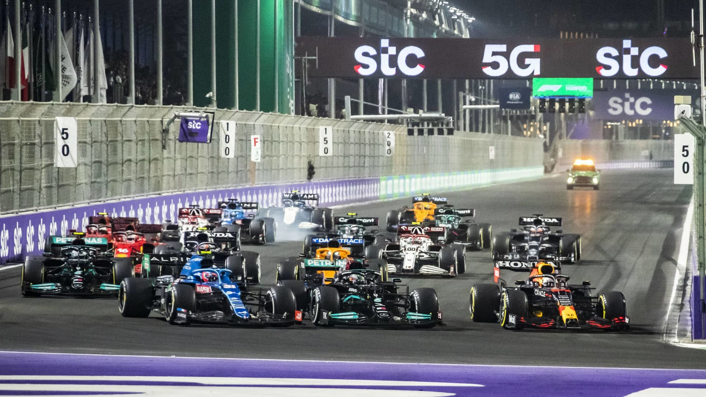
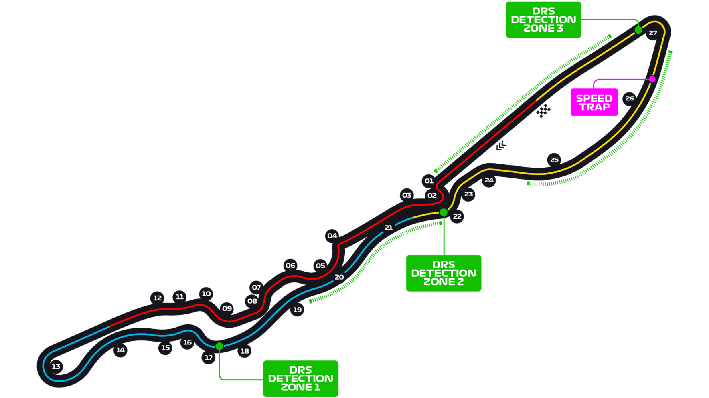

# 沙特阿拉伯大奖赛

2023 年 3 月 17 日 — 20 日

## 简介

沙特阿拉伯大奖赛（阿拉伯语：جائزة السعودية الكبرى‎）是一级方程式赛车赛事，从 2021 年起开始举行。比赛在位于沙特阿拉伯麦加省一个港口城市吉达的吉达滨海赛道上举行。沙特阿拉伯大奖赛亦为一级方程式赛车史上，继新加坡、巴林、萨基尔和卡塔尔大奖赛之后，第五个在夜间进行比赛的大奖赛赛事。[^1]

| 首次办赛 |  赛道长度  | 单圈记录 | 比赛圈数 |  比赛距离   |
| :------: | :--------: | :------: | :------: | :---------: |
| 2021 年  | 6.174 公里 | 1:30.734 |  50 圈   | 308.45 公里 |

## 比赛结果

|      冠军       |     亚军      |     季军      |   排位赛第一    |      杆位       |  正赛最快圈   |
| :-------------: | :-----------: | :-----------: | :-------------: | :-------------: | :-----------: |
|  |  |  | 塞尔吉奥·佩雷兹 |  |  |

[更多比赛细节](https://www.formula1.com/en/racing/2023/Saudi_Arabia.html)

[^1]: [维基百科词条：沙特阿拉伯大奖赛](https://zh.wikipedia.org/wiki/%E6%B2%99%E7%89%B9%E9%98%BF%E6%8B%89%E4%BC%AF%E5%A4%A7%E7%8D%8E%E8%B3%BD)
