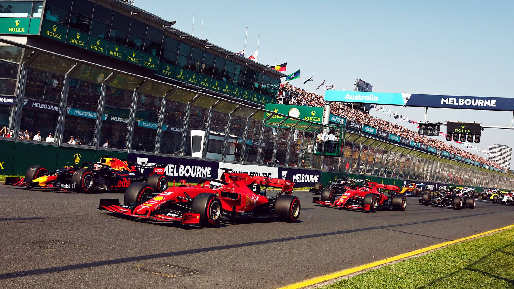
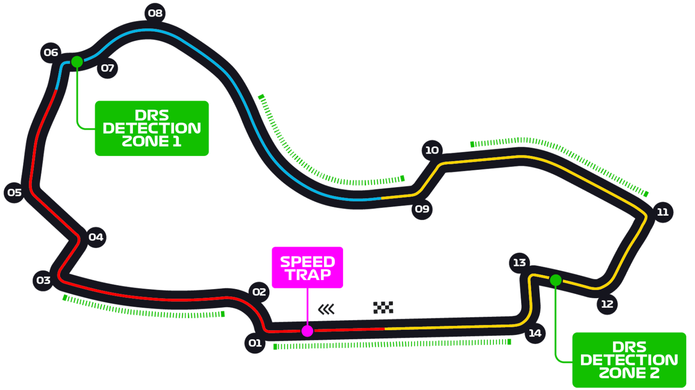

# 澳大利亚大奖赛

2023 年 3 月 31 日 — 4 月 2 日

## 简介

一级方程式赛车澳大利亚大奖赛（英语：Australian Grand Prix）从 1985 年起开始举行一直至今。

- 阿德莱德赛道，1985 年—1995 年。第一届澳大利亚大奖赛于 1985 年 11 月 3 日在阿德莱德赛道举行。
- 亚伯公园赛道（英文中称为墨尔本赛道），1996 年至今。1996 年 3 月 10 日，澳大利亚大奖赛开始转至阿尔伯特公园赛道进行，直至现在。[^1]

| 首次办赛 |  赛道长度  | 单圈记录 | 比赛圈数 |   比赛距离   |
| :------: | :--------: | :------: | :------: | :----------: |
| 1996 年  | 5.278 公里 | 1:20.260 |  58 圈   | 306.124 公里 |

## 比赛结果

|     冠军      |      亚军       |    季军     |  排位赛第一   |     杆位      |  正赛最快圈   |
| :-----------: | :-------------: | :---------: | :-----------: | :-----------: | :-----------: |
|  |  |  |  |  |  |

[更多比赛细节](https://www.formula1.com/en/racing/2023/Australia.html)

[^1]: [维基百科词条：澳大利亚大奖赛](https://zh.wikipedia.org/wiki/%E6%BE%B3%E5%A4%A7%E5%88%A9%E4%BA%9A%E5%A4%A7%E5%A5%96%E8%B5%9B)
