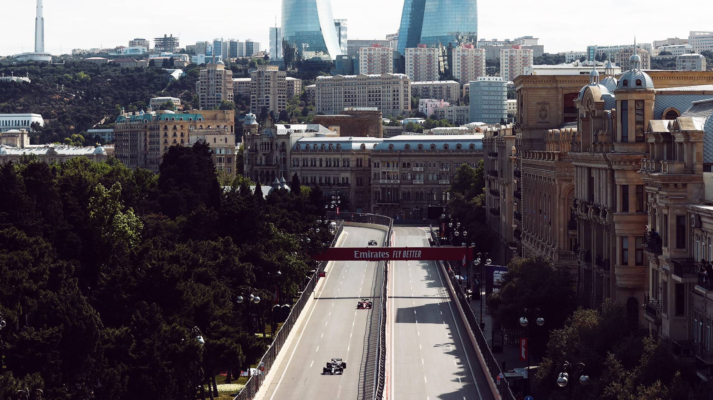
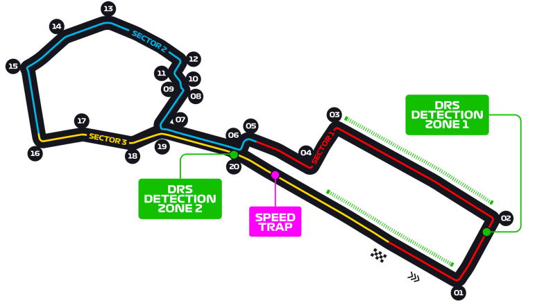

# 阿塞拜疆大奖赛

2023 年 4 月 28 日 — 30 日

## 简介

阿塞拜疆大奖赛（阿塞拜疆语：Azərbaycan Qran Prisi）是一场自 2017 年开始举办的一级方程式赛车分站赛事。这场大奖赛举办于阿塞拜疆首都巴库的巴库市街赛道，这条赛道的首场一级方程式赛车赛事为 2016 年的欧洲大奖赛。[^1]

| 首次办赛 |  赛道长度  | 单圈记录 | 比赛圈数 |   比赛距离   |
| :------: | :--------: | :------: | :------: | :----------: |
| 2016 年  | 6.003 公里 | 1:43.009 |  51 圈   | 306.049 公里 |

## 比赛结果

- 冲刺赛
  | 冠军 | 亚军 | 季军 | 排位赛第一 | 杆位 |
  | :--: | :--: | :--: | :--------: | :--: | :-------------: |
  | 塞尔吉奥·佩雷兹 | 夏尔·勒克莱尔 | 马克斯·维斯塔潘 | 夏尔·勒克莱尔 | 夏尔·勒克莱尔 |

- 正赛
  | 冠军 | 亚军 | 季军 | 排位赛第一 | 杆位 | 最快圈 |
  | :--: | :--: | :--: | :--------: | :--: | :-------------: |
  | 塞尔吉奥·佩雷兹 | 马克斯·维斯塔潘 | 夏尔·勒克莱尔 | 夏尔·勒克莱尔 | 夏尔·勒克莱尔 | 乔治·拉塞尔 |

[更多比赛细节](https://www.formula1.com/en/racing/2023/Azerbaijan.html)

[^1]: [维基百科词条：阿塞拜疆大奖赛](https://zh.wikipedia.org/wiki/%E4%BA%9E%E5%A1%9E%E6%8B%9C%E7%84%B6%E5%A4%A7%E7%8D%8E%E8%B3%BD)
